# FastMCP Migration Diagrams

## 1. Architecture Comparison: Python vs TypeScript + Effect

```mermaid
graph TB
    subgraph "Current Python Architecture"
        subgraph "FastMCP Python"
            PyServer[FastMCP Server<br/>- asyncio based<br/>- Class inheritance<br/>- Exception handling]
            PyClient[FastMCP Client<br/>- AsyncContextManager<br/>- Session management<br/>- Transport abstraction]
            PyTools[Tool Manager<br/>- Function decorators<br/>- Dynamic registration<br/>- Pydantic validation]
            PyAuth[Auth System<br/>- JWT/OAuth<br/>- Middleware chain<br/>- AsyncLocalStorage]
            PyTransport[Transport Layer<br/>- stdio/HTTP/SSE<br/>- Connection pooling<br/>- Error propagation]
        end
        
        subgraph "Python Dependencies"
            PyDeps[httpx, pydantic, uvicorn<br/>anyio, rich, authlib<br/>openapi-pydantic, cyclopts]
        end
    end
    
    subgraph "Target TypeScript + Effect Architecture"
        subgraph "FastMCP TypeScript"
            TsServer[FastMCP Server<br/>- Effect based<br/>- Functional composition<br/>- Typed error handling]
            TsClient[FastMCP Client<br/>- Effect.Scope<br/>- Resource management<br/>- Effect streams]
            TsTools[Tool Manager<br/>- Effect generators<br/>- Schema validation<br/>- Type-safe registration]
            TsAuth[Auth System<br/>- Effect Context<br/>- Middleware effects<br/>- Structured errors]
            TsTransport[Transport Layer<br/>- Effect streams<br/>- Connection effects<br/>- Error as values]
        end
        
        subgraph "TypeScript Dependencies"
            TsDeps[@effect/platform<br/>@effect/schema<br/>@effect/cli<br/>fastify, chalk, ws]
        end
    end
    
    PyServer --> TsServer
    PyClient --> TsClient
    PyTools --> TsTools
    PyAuth --> TsAuth
    PyTransport --> TsTransport
    PyDeps --> TsDeps
    
    style PyServer fill:#ffeb3b
    style TsServer fill:#4caf50
    style PyClient fill:#ffeb3b
    style TsClient fill:#4caf50
```

## 2. Migration Flow Diagram

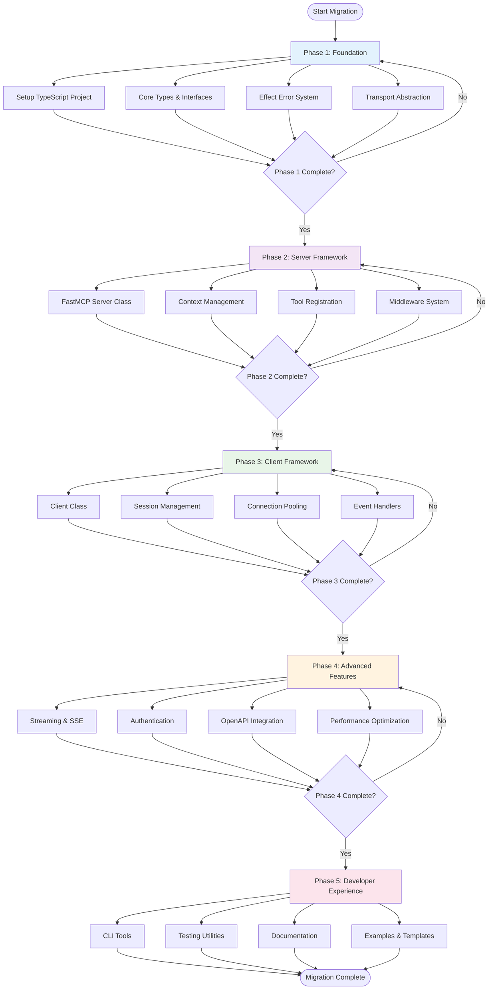

## 3. Dependency Mapping Diagram

```mermaid
graph LR
    subgraph "Python Ecosystem"
        httpx[httpx<br/>HTTP Client]
        pydantic[pydantic<br/>Data Validation]
        uvicorn[uvicorn<br/>ASGI Server]
        anyio[anyio<br/>Async Primitives]
        rich[rich<br/>Terminal UI]
        authlib[authlib<br/>OAuth/JWT]
        openapi[openapi-pydantic<br/>OpenAPI Schema]
        cyclopts[cyclopts<br/>CLI Framework]
        websockets[websockets<br/>WebSocket Support]
    end
    
    subgraph "TypeScript + Effect Ecosystem"
        http_client[@effect/platform<br/>HttpClient]
        schema[@effect/schema<br/>Schema Validation]
        fastify[fastify<br/>HTTP Server]
        effect_core[effect<br/>Functional Effects]
        chalk[chalk + custom<br/>Terminal Styling]
        auth_core[@auth/core + JWT<br/>Authentication]
        swagger[@apidevtools/<br/>swagger-parser]
        effect_cli[@effect/cli<br/>CLI Framework]
        ws[ws + Effect wrappers<br/>WebSocket]
    end
    
    httpx -.->|Maps to| http_client
    pydantic -.->|Maps to| schema
    uvicorn -.->|Maps to| fastify
    anyio -.->|Maps to| effect_core
    rich -.->|Maps to| chalk
    authlib -.->|Maps to| auth_core
    openapi -.->|Maps to| swagger
    cyclopts -.->|Maps to| effect_cli
    websockets -.->|Maps to| ws
    
    style httpx fill:#ffeb3b
    style http_client fill:#4caf50
    style pydantic fill:#ffeb3b
    style schema fill:#4caf50
    style anyio fill:#ffeb3b
    style effect_core fill:#4caf50
```

## 4. Pattern Transformation Diagram

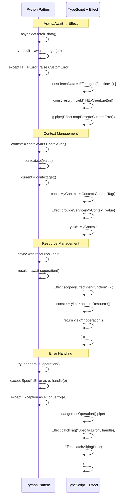

## 5. Timeline Gantt Chart

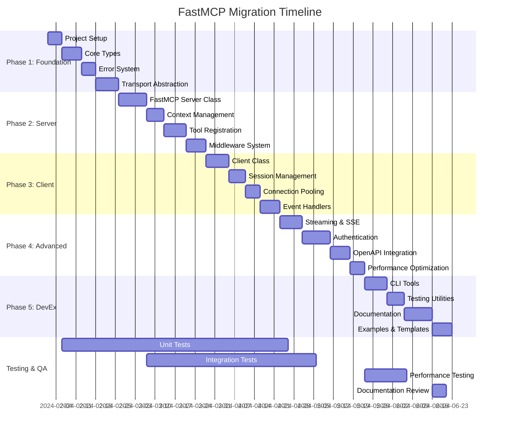

## 6. Component Architecture Diagram

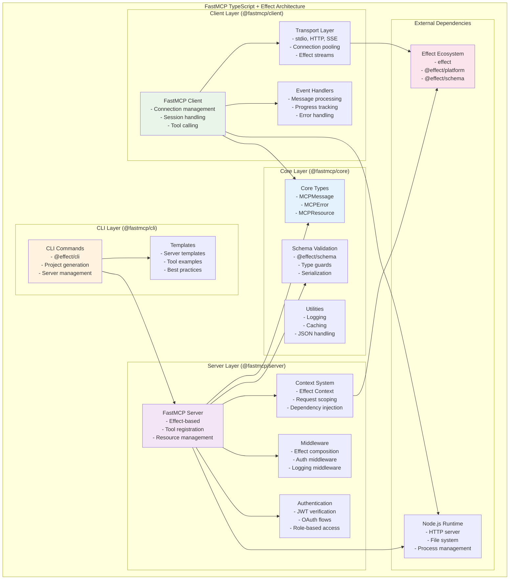

## 7. Data Flow Diagram

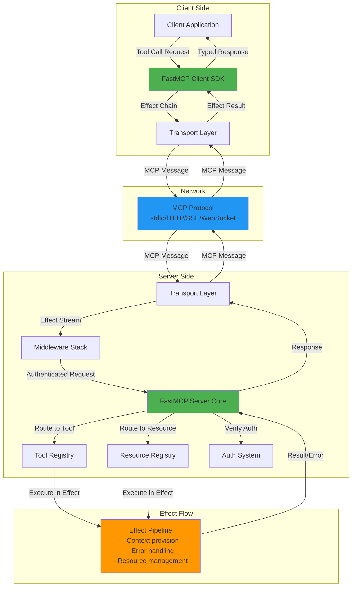

## 8. Testing Strategy Diagram

```mermaid
graph TB
    subgraph "Testing Pyramid"
        subgraph "Unit Tests"
            UnitCore[Core Types Tests<br/>- Schema validation<br/>- Error handling<br/>- Utilities]
            UnitServer[Server Tests<br/>- Tool registration<br/>- Context management<br/>- Middleware]
            UnitClient[Client Tests<br/>- Session handling<br/>- Transport logic<br/>- Event processing]
        end
        
        subgraph "Integration Tests"
            IntegrationMCP[MCP Protocol Tests<br/>- End-to-end flows<br/>- Transport compatibility<br/>- Error propagation]
            IntegrationAuth[Auth Integration<br/>- JWT verification<br/>- OAuth flows<br/>- Middleware chain]
        end
        
        subgraph "E2E Tests"
            E2EScenarios[Real-world Scenarios<br/>- Complex tool chains<br/>- Multi-client sessions<br/>- Performance testing]
        end
        
        subgraph "Property Tests"
            PropertyCore[Property-based Tests<br/>- Schema round-trips<br/>- Effect laws<br/>- Invariants]
        end
    end
    
    subgraph "Test Tools"
        EffectTest[@effect/vitest<br/>- Effect test runtime<br/>- Mock services<br/>- Property testing]
        TestUtils[Test Utilities<br/>- Mock servers<br/>- Test clients<br/>- Fixtures]
    end
    
    UnitCore --> EffectTest
    UnitServer --> EffectTest
    UnitClient --> EffectTest
    IntegrationMCP --> TestUtils
    IntegrationAuth --> TestUtils
    E2EScenarios --> TestUtils
    PropertyCore --> EffectTest
    
    style UnitCore fill:#e8f5e8
    style IntegrationMCP fill:#fff3e0
    style E2EScenarios fill:#fce4ec
    style PropertyCore fill:#e3f2fd
```

## 9. Risk Mitigation Flow

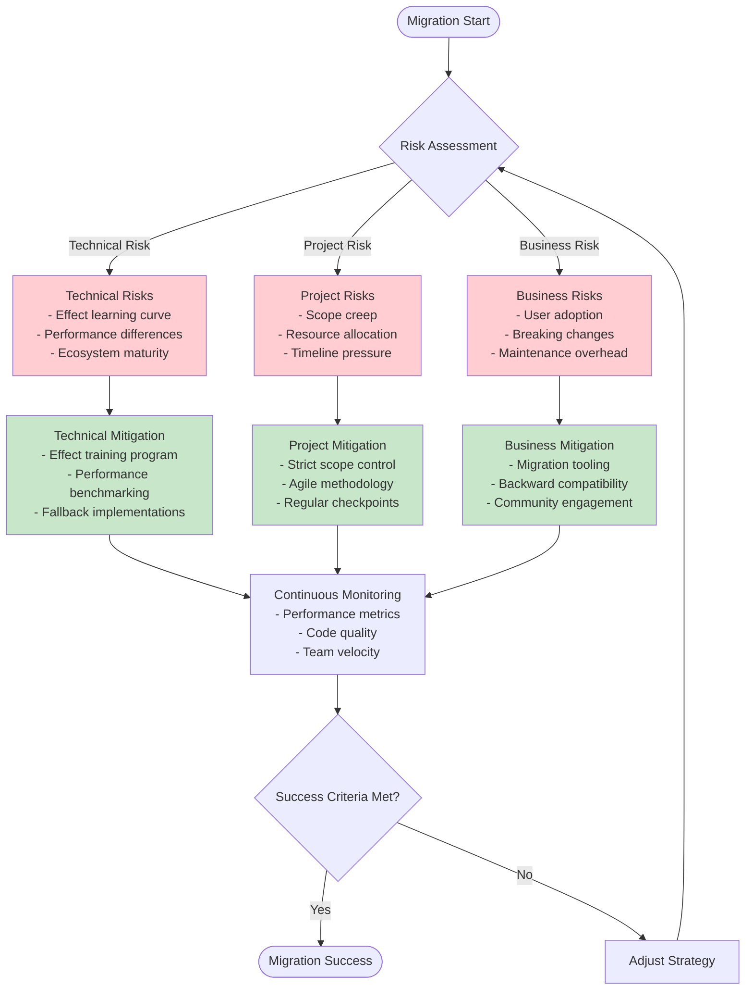

## 10. Deployment Architecture

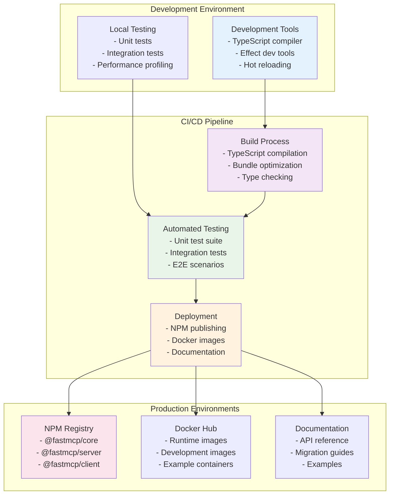

## 11. Code Transformation Examples

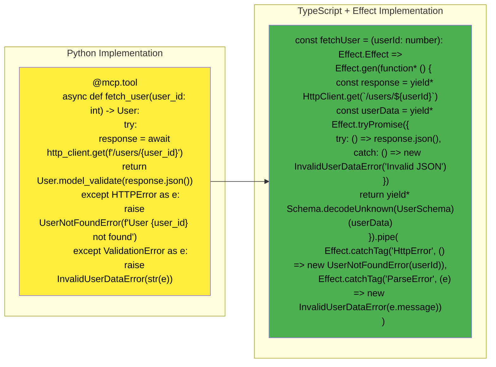

## 12. Error Handling Evolution

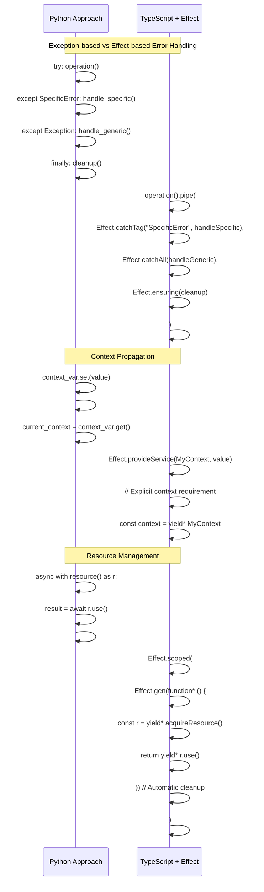

## 13. Performance Optimization Strategy

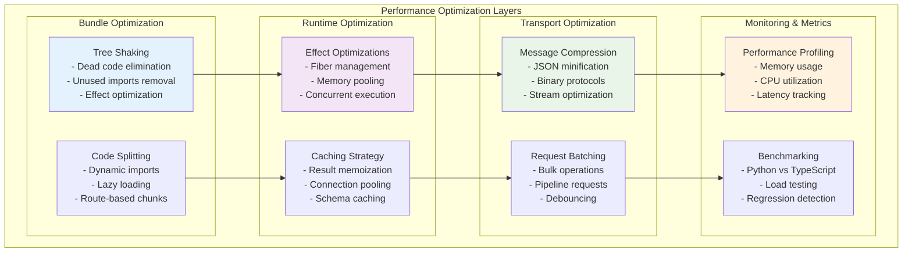

## 14. Migration Validation Framework

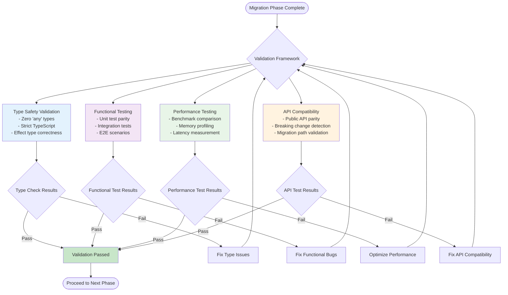

## 15. Team Onboarding & Training Flow

```mermaid
journey
    title Team Migration Training Journey
    section Week 1: Foundation
      TypeScript Review: 3: Team
      Effect Fundamentals: 2: Team
      FastMCP Architecture: 4: Team
      Setup Dev Environment: 3: Team
    section Week 2: Hands-on
      Effect Patterns: 4: Team
      Migration Examples: 5: Team
      Code Reviews: 3: Team
      Pair Programming: 5: Team
    section Week 3: Practice
      Convert Simple Module: 4: Team
      Write Tests: 3: Team
      Performance Analysis: 2: Team
      Documentation: 3: Team
    section Week 4: Integration
      Team Code Review: 5: Team
      Integration Testing: 4: Team
      Production Readiness: 3: Team
      Knowledge Transfer: 5: Team
```

## 16. Ecosystem Integration Map

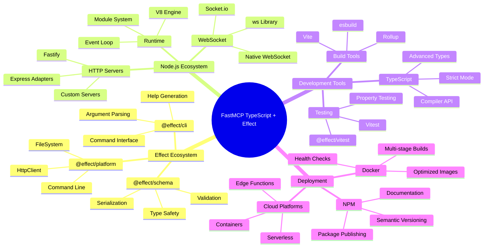

## 17. Migration Success Metrics Dashboard

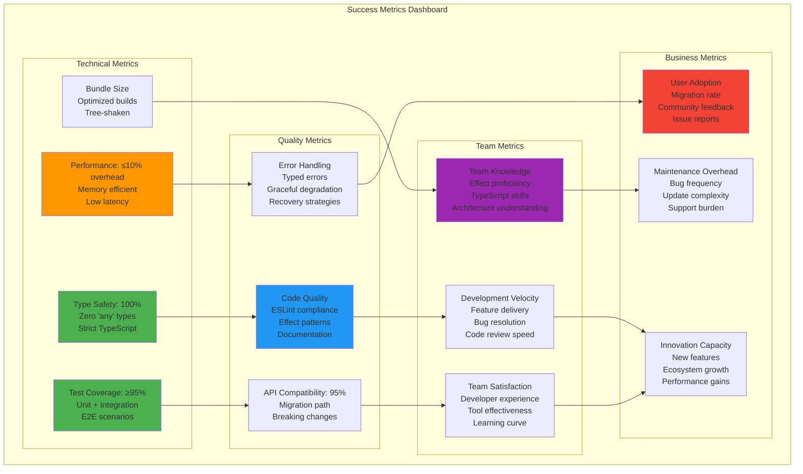